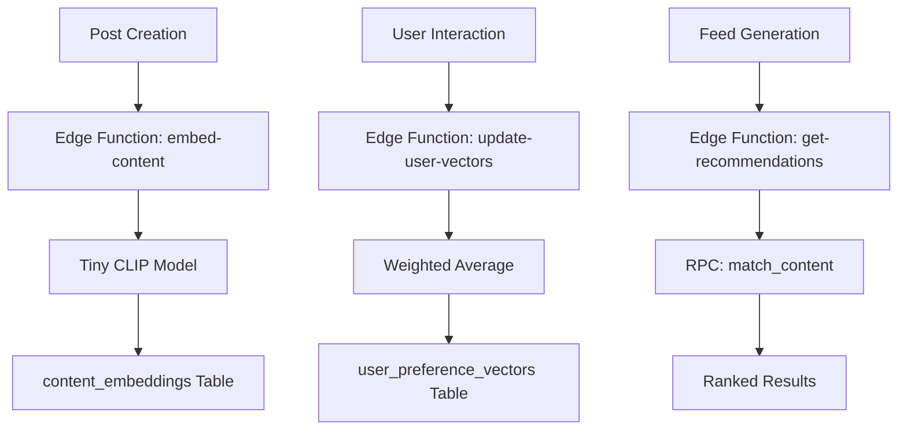

# Z Recommendation System (Supabase + Transformers.js)

This document outlines the architecture and implementation details of the recommendation system for Z.

## Overview
The system uses **Hybrid Vector Search** to find content that matches user preferences. It leverages **Transformers.js** running in Supabase Edge Functions to generate multi-modal embeddings from text and media.

## Architecture



## Interaction Weights

The `update-user-vectors` function applies different weights to user actions to build a high-fidelity taste profile. **Shares** are treated as the strongest indicator of interest.

| Interaction | Weight | Type |
| :--- | :--- | :--- |
| **Share / Repost** | +5 | Positive |
| **Like / Bookmark** | +3 | Positive |
| **View** | +1 | Positive |
| **Skip** | -1 | Negative |
| **Block** | -5 | Negative |

The system uses a **weighted running average** to update vectors:
`V_new = (V_old * interaction_count + V_curr * weight) / (interaction_count + weight)`

## Ranking Algorithm

The `get-recommendations` function supports two modes:

### 1. Viral Feed (`feed_type: 'viral'`)
Focuses on the last 24 hours of content.
- **Filtering**: Content created within the last 24h.
- **Scoring**: `Score = Engagement / (Age + 2)^1.8`
- **Engagement**: `(Shares * 5) + (Comments * 2) + (Likes * 1) + (Views * 0.1)`
- **Gravity**: Uses a power law to ensure new popular posts rise quickly but fade as they age.

### 2. Personalized Feed (`feed_type: 'personalized'`)
A hybrid approach that balances relevance with discovery.
- **Cold-Start Fallback**: Users with < 5 interactions see a 50/50 mix of Trending and Random New content.
- **The Sprinkle Factor (80/10/10)**:
  - **80% Personalized**: Based on vector similarity to the user's `positive_vector`.
  - **10% Trending**: High-gravity viral content from the last 24h.
  - **10% Discovery**: Randomly selected new posts to help the user find new interests.

## Automated Triggers & Scaling

The system is optimized for high-throughput interaction volume using a **Deferred Batch Processing** model.

### 1. Scaling Architecture
Instead of real-time updates for every interaction, the system uses a queue-based approach:
- **Sync Queue (`user_vector_sync_queue`)**: Database triggers on `user_interactions` and `bookmarks` simply "mark" a user as having new activity.
- **Scheduled Processing (`pg_cron`)**: Every 5 minutes, a cron job calls the `batch-update-user-vectors` Edge Function.
- **Batch Processing**: The Edge Function aggregates all interactions for a user since their last update and performs a **single** optimized vector calculation and DB write.

### 2. Client-Side Debouncing
The Flutter app buffers "view" events locally for 10 seconds or 20 items before flushing them to the database, further reducing network overhead and DB noise.

## Deployment

Edge functions are deployed via the Supabase Dashboard or CLI:
```bash
supabase functions deploy embed-content
supabase functions deploy get-recommendations
supabase functions deploy batch-update-user-vectors
```
