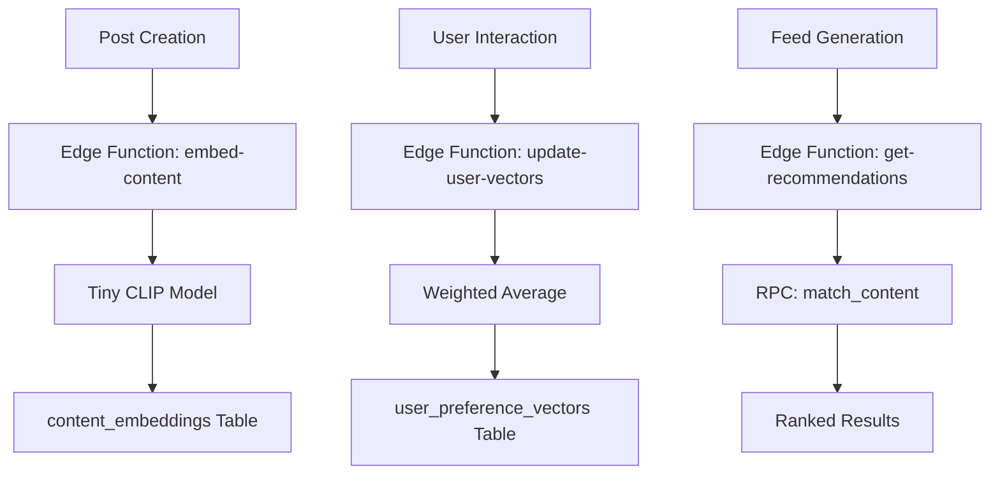

# Z Recommendation System (Supabase + Transformers.js)

This document outlines the architecture and implementation details of the recommendation system for Z.

## Overview
The system uses **Hybrid Vector Search** to find content that matches user preferences. It leverages **Transformers.js** running in Supabase Edge Functions to generate multi-modal embeddings from text and media.

## Architecture



## Database Schema

### `content_embeddings`
Stores the vector representation of every post (Zap, Short, Story).
- **Dimension**: 512 (Tiny CLIP)
- **Linkage**: `target_id` matches the post ID.

### `user_preference_vectors`
Stores a "taste" vector for each user.
- **Positive Vector**: Represents content the user liked or viewed fully.
- **Negative Vector**: Represents content the user skipped or blocked.

## Multi-modal Embedding Strategy

### Model: `Xenova/clip-vit-tiny-patch14`
A fast, lightweight CLIP model that maps text and images into the same 512-dimensional vector space.

### Input Processing (`embed-content`)
1. **Text**: The caption or text content is embedded directly.
2. **Images**: If the media is an image, it is resized and passed to the model.
3. **Videos**: 
   - Extract up to 10 frames based on video length.
   - Embed each frame.
   - Use the **mean embedding** of the frames + text for the final representation.

## Ranking Algorithm
The `get-recommendations` function calculates a final score:
`score = (0.6 * cosine_similarity) + (0.2 * engagement_score) + (0.2 * recency_score)`

- **Engagement**: Based on likes, comments, and shares.
- **Recency**: Decays over time (half-life of 24h).

## Deployment
Edge functions are deployed using the Supabase CLI:
```bash
supabase functions deploy embed-content
supabase functions deploy update-user-vectors
supabase functions deploy get-recommendations
```
